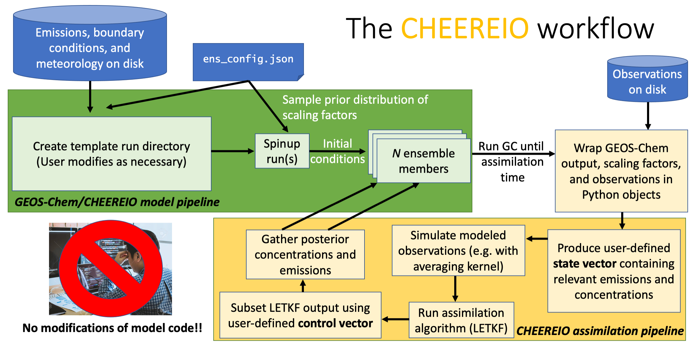

About CHEEREIO
==========

What CHEEREIO is
-------------

The CHEmistry and Emissions REanalysis Interface with Observations (CHEEREIO) is a package that wraps the `GEOS-Chem <https://github.com/geoschem>`__ chemical transport model source code. After a simple modification of a single configuration file (``ens_config.json``), CHEEREIO automatically produces and compiles a template GEOS-Chem run directory, which it then copies into an ensemble. Each ensemble member comes with a randomized set of gridded emissions scaling factors for species specified by the user. As the ensemble of runs progresses, CHEEREIO will periodically pause the ensemble, compare with a set of observations (i.e. satellite, surface, and/or aircraft), and update relevant emissions scaling factors and chemical concentrations to best match reality given the uncertainties of measurements and model. CHEEREIO calculates this update via the 4D Asynchronous Localized Ensemble Transform Kalman Filter (4D-LETKF) as described in `Hunt. et. al., [2007] <https://doi.org/10.1016/j.physd.2006.11.008>`__. Because this approach is model agnostic (specifically, it does not rely on the adjoint), CHEEREIO supports emissions updates and chemical concentration corrections for arbitrary configurations of the GEOS-Chem model. However, the current CHEEREIO codebase assumes that GEOS-Chem code is version 13.0.0 or later.

An overview of the CHEEREIO workflow
-----------------------------

The CHEEREIO workflow is described in detail throughout this documentation, but here is a brief overview divided into two main parts: **installation** time and **run** time.

**Installation time.** First, the user creates a template run directory by executing a script related to the setup procedure in GEOS-Chem version 13. Any modifications to the template directory should happen at this point, as these changes will be reflected across all ensemble members. Note that this run directory has a few slightly different features from the standard run directory to allow CHEEREIO to hook in and modify files on the fly. Users should carefully read the documentation before changing something they find odd in the template run directory. Next, the user compiles the template run directory, either according to their preferences or by following the base procedure in the CHEEREIO setup script. Then a spinup directory can be generated and run if the user wants to do spinup within the CHEEREIO environment. Alternatively, the user can  supply an already spun-up restart file. Finally, the ensemble is installed; many copies of the template run directory are made and will be run in parallel. The default ensemble size is 32 but the user is free to run ensembles of any size. All files are installed in a user-specified CHEEREIO ensemble directory which is distinct from the directory that stores the core CHEEREIO scripts.

**Run time.** The user navigates to the ensemble_runs folder in the CHEEREIO ensemble directory and executes the ``run_ens.sh`` script. This allocates a job for each of the ensemble members and starts GEOS-Chem in each. After one assimilation period completes, then GEOS-Chem halts and the CHEEREIO assimilation routine is called. Each column is assimilated in parallel, with intermediate outputs stored in the scratch folder. After each column is complete, CHEEREIO gathers the data from scratch and overwrites the GEOS-Chem restarts and scaling factors in each ensemble run directory folder. From here, GEOS-Chem is called and runs for another assimilation period. CHEEREIO will then rinse and repeat until the period of interest has been processed.

How CHEEREIO works
-----------------------------

Although the mathematics of CHEEREIO is complex (see :ref:`Further Reading` for details), the algorithm that powers this package is quite intuitive. The LETKF algorithm follows an ensemble approach. This means that CHEEREIO is managing many (often 32) simultaneously running simulations of the atmosphere, each representing different assumptions (usually represented in the form of varying emissions scaling factors). The ensemble itself thus represents our uncertainty of the atmospheric state that arises from the uncertainty in our assumptions (e.g., the range of ammonia concentrations we would expect to arise in the atmosphere given our uncertainty in ammonia emissions). We might have some observations of the real atmosphere at a given time, such as those from a satellite column, from surface measurements, or from an aircraft campaign. This observation, which comes with its own uncertainty, constrains the reasonable range of concentrations our model should represent. Even if we only observe a related species (such as SO\ :sub:`2`\ , NO\ :sub:`2`\ , or even AOD, which might give us a clue on the state of Sulfate-Nitrate-Ammonium aerosol formation), we still may have some useful information that will allow CHEEREIO to update the emissions and concentrations of interest. As the figure below demonstrates, this results in updates of the entire ensemble to better match reality.

.. image:: ensemble_diagram.png
  :width: 600
  :alt: Figure demonstrating how ensemble of simulations is adjusted to match observations over time. 

One way to think about this is that the ensemble emulates the error matrix for the model, giving us a kind of "low rank approximation" of model uncertainty. Since we know the error matrix for the observations (or at least can make an educated guess), then we can consider LETKF as a Bayesian method that updates a prior distribution of concentrations and emissions to create a posterior ensemble that better reflects reality. With each update, LETKF accumulates information about the true atmospheric state.

.. _Further reading:

Further reading
-----------------------------

LETKF comes from the rich tradition of data assimilation, and there is far more to it than can be described in this documentation. The 4D-LETKF algorithm was first described in `Hunt. et. al., [2007] <https://doi.org/10.1016/j.physd.2006.11.008>`__, which includes a detailed step-by-step description of how one might implement the computation. For a painfully detailed slide deck giving a crash course in data assimilation, linking LETKF with other methods (3DVAR, 4DVAR, EnKF, etc.) email me (pendergrass [AT] g [DOT] harvard [DOT] edu) and I will send it along. Those notes were developed from a variety of sources, including `Data Assimilation: Methods, Algorithms, and Applications <https://doi.org/10.1137/1.9781611974546>`__ by Asch, Bocquet, and Nodet and the `ECMWF's lecture notes <https://www.ecmwf.int/en/learning/education-material/lecture-notes>`__. `Kazuyuki Miyazaki <https://science.jpl.nasa.gov/people/Miyazaki/>`__ at the Jet Propulsion Laboratory pioneered the use of LETKF for chemical data assimilation, and his papers are extremely valuable in understanding this rapidly developing field.