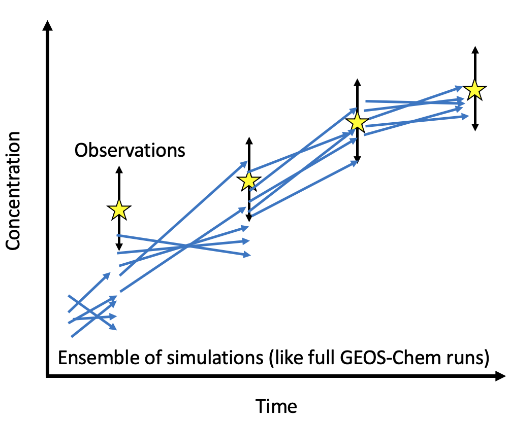
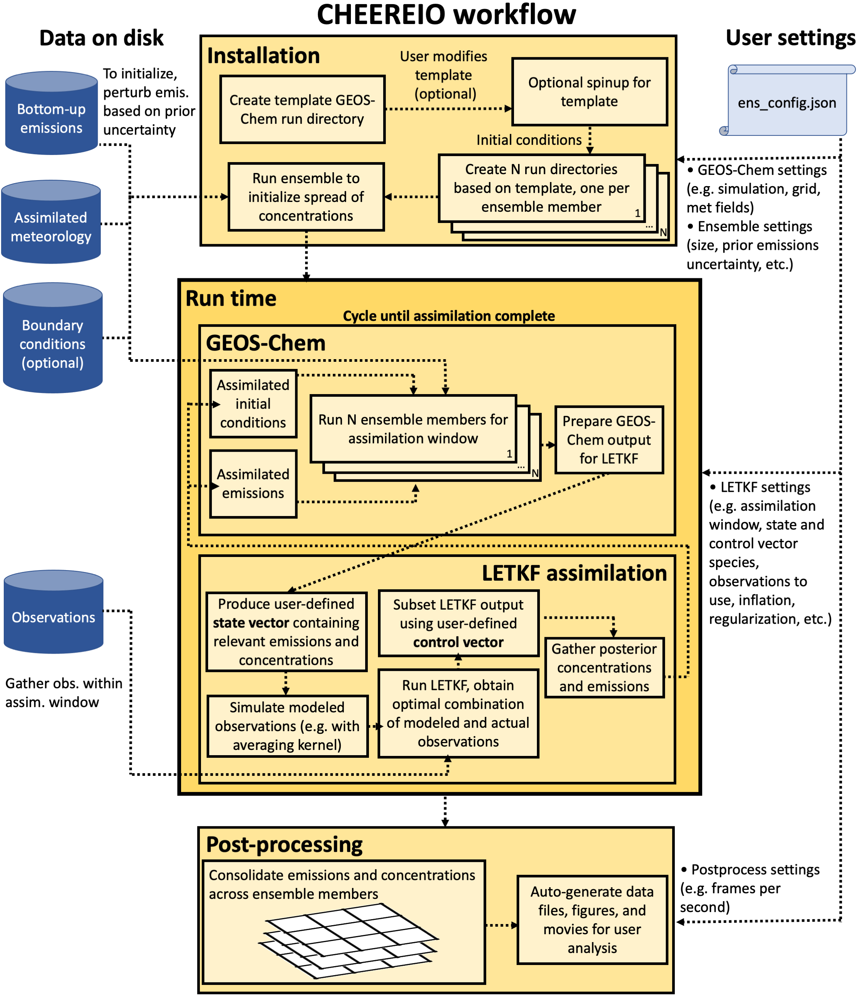
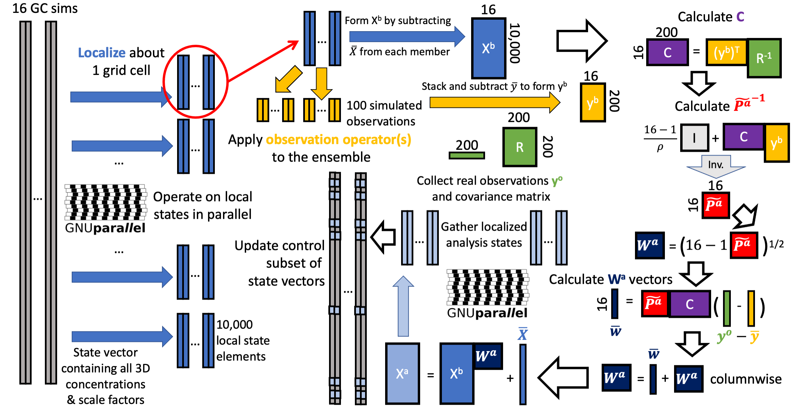

About CHEEREIO
==========

What CHEEREIO is
-------------

The CHEmistry and Emissions REanalysis Interface with Observations (CHEEREIO) is a package that wraps the `GEOS-Chem <https://github.com/geoschem>`__ chemical transport model source code. After a simple modification of a single configuration file (``ens_config.json``), CHEEREIO automatically produces and compiles an ensemble of GEOS-Chem run directories. Each ensemble member comes with a randomized set of gridded emissions scaling factors, drawn from a prior distribution reflecting user-specified emissions uncertainties, for the set of species specified by the user. As the ensemble of runs progresses, CHEEREIO will periodically pause the ensemble, compare with a set of observations (i.e. satellite, surface, and/or aircraft), and update relevant emissions scaling factors and chemical concentrations to best match reality given the uncertainties of measurements and model. CHEEREIO calculates this update via the 4D Asynchronous Localized Ensemble Transform Kalman Filter (4D-LETKF) as described in `Hunt. et. al., [2007] <https://doi.org/10.1016/j.physd.2006.11.008>`__. Because this approach is model agnostic (specifically, it does not rely on the adjoint), CHEEREIO supports emissions updates and chemical concentration corrections for arbitrary configurations of the GEOS-Chem model. However, the current CHEEREIO codebase assumes that GEOS-Chem code is version 13.0.0 or later.

.. _How CHEEREIO works:

How CHEEREIO works
-----------------------------

Although the mathematics of CHEEREIO is complex (see :ref:`Further Reading` for details), the algorithm that powers this package is quite intuitive. The LETKF algorithm follows an ensemble approach. This means that CHEEREIO is managing many (often 32 or 48) simultaneously running simulations of the atmosphere, each representing different assumptions (usually represented in the form of varying emissions scaling factors). The ensemble itself thus represents our uncertainty of the atmospheric state that arises from the uncertainty in our assumptions (e.g., the range of ammonia concentrations we would expect to arise in the atmosphere given our uncertainty in ammonia emissions). We might have some observations of the real atmosphere at a given time, such as those from a satellite column, from surface measurements, or from an aircraft campaign. This observation, which comes with its own uncertainty, constrains the reasonable range of concentrations our model should represent. Even if we only observe a related species (such as SO\ :sub:`2`\ , NO\ :sub:`2`\ , or even AOD, which might give us a clue on the state of Sulfate-Nitrate-Ammonium aerosol formation), we still may have some useful information that will allow CHEEREIO to update the emissions and concentrations of interest. As the figure below demonstrates, this results in updates of the entire ensemble to better match reality.

One way to think about this is that the ensemble emulates the error matrix for the model, giving us a kind of low rank approximation of model uncertainty. Since we know the error matrix for the observations (or at least can make an educated guess), then we should consider the LETKF as a Bayesian method that updates a prior distribution of concentrations and emissions to create a posterior ensemble that better reflects reality. With each update, the LETKF accumulates information about the true atmospheric state.

.. _Workflow overview:

An overview of the CHEEREIO workflow
-----------------------------

The CHEEREIO workflow is described in detail throughout this documentation, but here is a brief overview divided into four main parts: **initialization** time, **spinup** time, **run** time, and **postprocess** time.

Initialization time
~~~~~~~~~~~~~

First, the user creates a template run directory by executing a script related to the setup procedure in GEOS-Chem version 13+, ``setup_ensemble.sh``. The template run directory is a regular GEOS-Chem run directory, but with a few slightly different features which allow CHEEREIO to hook in and modify files on the fly (more information here: :ref:`Installation`). All ensemble members will be run in run directories copied from the template run directory, so any changes to the template will be reflected across all ensemble members. Next, the user compiles the template run directory, either according to their preferences or by following the base procedure in the CHEEREIO setup script ``setup_ensemble.sh``.

Spinup time
~~~~~~~~~~~~~

There are two separate kinds of model spinup in the CHEEREIO environment. The first kind is the standard form of GEOS-Chem model spinup. By setting ``SetupSpinupRun`` to ``true`` in ``setup_ensemble.sh`` a standard GEOS-Chem run directory is created based on the template run directory where spinup can be done for all ensemble members. The restart saved out at the end of the simulation will be automatically linked in each of the ensemble run directories. Alternatively, the user can supply an already spun-up restart file and skip this process. (More details here: :ref:`spinup simulation`).

The second kind of spinup, called ensemble spinup, is unique to CHEEREIO and required for all simulations. The LETKF algorithm requires each ensemble member to have different atmospheric conditions, reflecting the randomized set of emissions scaling factors applied to each ensemble member. This is because the ensemble spread is used to emulate the prior error covariance matrix, a key component of any inversion or data assimilation problem. In practice, this means that before the LETKF process can begin each ensemble member must be run for a period of time with the randomized set of emissions scaling factors applied. This ensemble spinup process creates a diversity of atmospheric concentrations across the ensemble, which leads to a better estimate of the prior error covariance matrix. There are two ways to do ensemble spinup in CHEEREIO, which are discussed here: :ref:`Run Ensemble Spinup Simulations`.

However, before ensemble spinup can be executed, the ensemble run directories must be created from the template run directory. Ensemble run directories are created by the ``setup_ensemble.sh`` script, which makes many copies of the template run directory to be executed in parallel at run time. The default ensemble size is 32 but the user is free to run ensembles of any size. All files for the ensemble simulations are installed in a user-specified CHEEREIO ensemble directory which is distinct from the directory that stores the core CHEEREIO scripts. This allows users to run many CHEEREIO simulations from the same code base, like in GEOS-Chem.

Run time
~~~~~~~~~~~~~

Once installation and spinup(s) are complete, the user navigates to the ``ensemble_runs/`` folder in the CHEEREIO ensemble directory and executes the ``run_ens.sh`` script. This allocates a job for each of the ensemble members and starts GEOS-Chem in each. After one assimilation period completes, then GEOS-Chem halts and the CHEEREIO assimilation routine is called. Each column is assimilated in parallel, with intermediate outputs stored in the ``scratch/`` folder. After each column is complete, CHEEREIO gathers the data from scratch and overwrites the GEOS-Chem restarts and scaling factors in each ensemble run directory folder. From here, GEOS-Chem is called and runs for another assimilation period. CHEEREIO will then repeat this process until the entire period of interest has been simulated. More details here: :ref:`Run the ensemble`.

Postprocess time
~~~~~~~~~~~~~

Once the ensemble run is complete, users have access to a variety of tools and pre-built workflows in the ``postprocess/`` folder of the main CHEEREIO code directory. In particular, the SLURM batch script ``postprocess_prep.batch`` will automatically create a variety of figures, movies, and consolidated data files that the user can then view and modify. The folder also includes an API of useful functions in the ``postprocess_tools.py`` file. Details are given here: :ref:`Postprocessing workflow`.

The figure below summarizes the CHEEREIO workflow.

.. _Further reading:

Further reading
-----------------------------

LETKF comes from the rich tradition of data assimilation, and there is far more to it than can be described in this documentation. The 4D-LETKF algorithm was first described in `Hunt. et. al., [2007] <https://doi.org/10.1016/j.physd.2006.11.008>`__, which includes a detailed step-by-step description of how one might implement the computation. You can download a painfully detailed slide deck I made in 2021 that gives a crash course in data assimilation, linking LETKF with other methods (3DVAR, 4DVAR, EnKF, etc.), at `this link <http://drewpendergrass.com/online_data_assimilation_crash_course.pptx>`__. Those notes were developed from a variety of sources, including `Data Assimilation: Methods, Algorithms, and Applications <https://doi.org/10.1137/1.9781611974546>`__ by Asch, Bocquet, and Nodet and the `ECMWF's lecture notes <https://www.ecmwf.int/en/learning/education-material/lecture-notes>`__. `Kazuyuki Miyazaki <https://science.jpl.nasa.gov/people/Miyazaki/>`__ at the Jet Propulsion Laboratory pioneered the use of LETKF for chemical data assimilation, and his papers are extremely valuable in understanding this rapidly developing field.

To whet your appetite for the LETKF algorithm, below is a diagram of the matrices formed in the process of the assimilation computation. Some aspects of this, particularly the distinction between a control and state vector, will be discussed later in the documention. The details of the mathematics are left to the `Hunt. et. al., [2007] <https://doi.org/10.1016/j.physd.2006.11.008>`__ paper.

