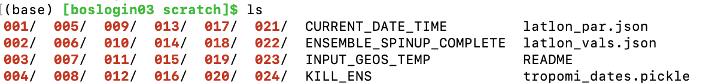

Debugging CHEEREIO
==========

.. _Fix Kill Ens:

Help! CHEEREIO killed my ensemble
-------------

So you've found the dreaded KILL_ENS file in your ensemble's ``scratch`` folder. This file is produced by CHEEREIO if something goes wrong with either (1) GEOS-Chem, or (2) the assimilation routine. The presence of this file signals all runs to cease operations and exit with nonzero status. Here we discuss the most common causes of ensemble failure and how to fix them. First, if the ensemble is still running, cancel it. Next, examine the contents of KILL_ENS. The file will give you an idea of where to look for more detailed error information. 

GEOS-Chem problems
~~~~~~~~~~~~~~~~~~~~~~~~~~~~~

When you examine the contents of KILL_ENS, you might find the message "GEOS-Chem in ensemble member x did not complete successfully." This means that at least one of our GEOS-Chem runs failed to complete successfully. Navigate to the corresponding run directory in the ``ensemble_runs`` folder and look at the end of the GEOS-Chem log file ``GC.log``. This file will have a traceback that describes the GEOS-Chem error. You should also look at the corresponding shell error file, which will be stored in the ``ensemble_runs/logs`` folder in a file named ``ensemble_slurm_JOBNUMBER.err``, which might offer further information like an out-of-memory error. Consult the `GEOS-Chem debugging page <http://wiki.seas.harvard.edu/geos-chem/index.php/Debugging_GEOS-Chem>`__ for more guidance on how to debug GEOS-Chem. 

Some rules of thumb: If GEOS-Chem fails immediately after the runs begin, the problem probably has to do with either the `Unix environment <https://geos-chem.readthedocs.io/en/latest/gcc-guide/01-startup/login-env.html#>`__ or a problem with settings files, such as HEMCO_Config.rc or input.geos, or a missing or incompatible data files (e.g. no restart, no meteorology). The GC.log file will give you a clue as to what your problem is. If you are missing a library file (e.g. libnetcdf.so) this means your Unix environment is not correctly specified. We recommend that you modify the ``cheereio.env`` file provided in the ``environments`` folder to match your cluster environment. It is also very common in CHEEREIO to hit out-of-memory errors, though this is more often seen in the assimilation phase. Finally, like any piece of complicated software in a shared environment, sometimes GEOS-Chem fails randomly. 

Sub-zero scaling factors
~~~~~~~~~~~~~~~~~~~~~~~~~~~~~

One common problem is caused by scaling factors falling below zero. GEOS-Chem, depending on simulation settings, will often fail automatically if negative emissions are detected. For many emissions optimization experiments, negative emissions are also forbidden given domain knowledge. Sub-zero scaling factors can be prevented by either (1) setting the ``MinimumScalingFactorAllowed`` setting to some value above 0, or (2) setting the ``lognormalErrors`` option to ``True``. Both of these settings are described on the :ref:`Scaling factor settings` page.

Assimilation problems
~~~~~~~~~~~~~~~~~~~~~~~~~~~~~

When you examine the contents of KILL_ENS, you might find the message "Python assimilation script exited without code 0 in ensemble x and core y." This means that at least one of our assimilation routines failed to complete successfully. To figure out what went wrong, look at the corresponding shell error file, which will be stored in the ``ensemble_runs/logs`` folder in a file named ``ensemble_slurm_JOBNUMBER.err``. This will include the Python traceback that caused the problem. For fully-tested CHEEREIO routines, such as TROPOMI CH4, the most common cause of problems are out-of-memory errors. Occasionally assimilation will also fail for random reasons related to cluster hiccups. For less tested CHEEREIO experiments, the error may be more substantial and emerge from either errors in user implementation, or from a bug in the software. Please open an `issue <https://github.com/drewpendergrass/CHEEREIO/issues>`__ on Github if you think that your error is due to the base CHEEREIO software, or if you have a question best addressed by the developer. 

Vanishing ensemble spread
~~~~~~~~~~~~~~~~~~~~~~~~~~~~~

When all enemble members have a value in the state vector that clusters around a single value, the LETKF algorithm will encounter a divide-by-zero error. This is because the ensemble spread is in the denominator at one stage in the LETKF algorithm. A vanishing ensemble spread happens most commonly when users imposse a posterior constraint on scaling factors, usually by setting ``MinimumScalingFactorAllowed`` and/or ``MaximumScalingFactorAllowed`` to some finite value (these settings are discussed on the :ref:`Scaling factor settings` page). For example, if all ensemble members simultaneously are pushed to a negative scale factor but ``MinimumScalingFactorAllowed`` forbids negative scalings, then all ensemble members will be set to the value given in ``MinimumScalingFactorAllowed``. This means that there is zero spread and the LETKF algorithm will fail. To fix this problem, turn off the ``MinimumScalingFactorAllowed`` and/or ``MaximumScalingFactorAllowed`` options and use lognormal scalings instead (activated by setting the ``lognormalErrors`` option to ``True``)

I think I solved it!
~~~~~~~~~~~~~~~~~~~~~~~~~~~~~

If you conclude that the KILL_ENS file was produced by a minor problem, such as an out-of-memory error, bad Unix environment, a random cluster hiccup, or an easily-resolved fix to source code, you can run the ``cleanup_after_kill_ens.sh`` script from within the ``core/`` folder. This script will take care of some of the main technicalities that can cause a resubmitted CHEEREIO run to fail, such as making sure that all signal files are aligned. From there, you can simply resubmit the job array. However, CHEEREIO is a complex piece of code and sometimes errors can root themselves deeply in the ensemble in ways that are difficult to remove. If your second submission fails, it is easiest to (1) use the clean spun-up backup ensemble, or (2) fully redeploy the ensemble. This is the CHEEREIO equivalent of turning it off and back on again.

CHEEREIO is running, but my ensemble is not updating
-------------

Sometimes CHEEREIO runs successfully but updates do not appear to be applied to the ensemble. Here are some common reasons why this might be happening:

Updates to scale factors but not emissions
~~~~~~~~~~~~~~~~~~~~~~~~~~~~~

If SCALEFACTOR.nc files are changing over time, but ensemble GC simulations do not show any emission changes, there is likely a disconnect between CHEEREIO and GEOS-Chem. This is diagnosed most easily by comparing control emissions with ensemble emissions by using the relevant HEMCO diagnostics (e.g. total methane emissions for a methane inversion are identical between control and ensemble simulations). If this happens to you, it is usually because of a problem with the HEMCO_Config.rc file. In th Check to see that CHEEREIO successfully linked individual emissions with SCALEFACTOR.nc files in your template run directory. CHEEREIO scalefactor codes begin at 700 and increment by 1 for each emission you adjust. 

Here is an example emission file adjusted by CHEEREIO in a methane assimilation simulation: ``0 GEPA_GAS_PRODUCTION   $ROOT/CH4/v2017-10/GEPA/GEPA_Annual.nc  emissions_1B2b_Natural_Gas_Production        2012/1/1/0    C xy molec/cm2/s CH4 1008/700    2 100``

This emissions file is scaled correctly farther down in the the HEMCO_Config.rc file: ``700 ASSIM_CH4  /n/holyscratch01/jacob_lab/dpendergrass/GC-LETKF/METHANE_scale_v06/template_run/CH4_SCALEFACTOR.nc Scalar 2018-2020/1-12/1-31/0-23 RF xy 1  1``

This tells GEOS-Chem that it should scale natural gas production emissions by the CHEEREIO posterior scaling factor values stored in the CH4_SCALEFACTOR.nc file. Sometimes, especially in cases where emissions are grouped into chemical families, CHEEREIO does not successfully update HEMCO_Config.rc on its own and requires manual user correction.

Miniscule updates to both scale factors and emissions
~~~~~~~~~~~~~~~~~~~~~~~~~~~~~

Users commonly report that in their initial simulations, scale factors and emissions do successfully update but at far too slow a rate. This usually means that ensemble settings strongly weight the prior in the LETKF algorithm, effectively discarding or nearly discarding observations. Here are some common settings that can lead to an overly strong prior:

* **Observation errors are too large.** Observation errors are discussed in the :ref:`LETKF settings` page. For a sanity check, adjust observation errors to be quite small. This might mean setting the ``OBS_ERROR_TYPE`` setting to ``relative`` and setting the ``OBS_ERROR`` value to be something like 0.001 for each of your observation datasets. This means that you have a 0.1% error on your observation values. With this setting, you should expect CHEEREIO to more strongly adjust to match observations (although it will likely overfit).
* **Gamma is too small.** Like observation errors, the regularizing constant gamma is discussed in the :ref:`LETKF settings` page. Gamma works like observation errors in that it weights the observations relative to the prior in the cost function optimized by the LETKF algorithm. Consider setting ``REGULARIZING_FACTOR_GAMMA`` to be something like 10 for each of your observation datasets. This means that you weight observations to be ten times more strong in the cost function than errors alone would suggest.
* **The posterior is being averaged with the prior.** Users can average posterior results with the prior by activating either the ``AveragePriorAndPosterior`` or the ``AverageScaleFactorPosteriorWithPrior`` options on the :ref:`LETKF settings` page. In practice, these options tend to very strongly push posterior results towards the prior and are generally suboptimal in LETKF applications. If either option is set to ``True``, try setting it to ``False`` and see if results improve.
* **Ensemble spread is too small.** The prior estimate is weighted according to the ensemble spread. If the ensemble spread is too small, then the prior will be very strongly preferred and observations discarded. Ensemble spread can be amplified through a variety of means.
  * Set ``INFLATION_FACTOR``, as described on the :ref:`LETKF settings` page, to a higher value.
  * Run ensemble spinup, as described on the :ref:`Run Ensemble Spinup Simulations` page, for a longer period.
  * Amplify the ensemble spread after ensemble spinup, as described on the :ref:`Spread amplification` page, by a larger value.
  * Ensure that scaling factors spreads do not shrink too much by setting ``InflateScalingsToXOfPreviousStandardDeviation`` to some value (0.3 seems to be a common value in the literature), as described on the :ref:`Scaling factor settings` page.

No updates to either scale factors or emissions
~~~~~~~~~~~~~~~~~~~~~~~~~~~~~

In the case where neither scale factors nor emissions are updated, there may be a disconnect between CHEEREIO and GEOS-Chem as described above (in the Updates to scale factors but not emissions section). However, assimilation may also be turned off. Ensure that ``ASSIMILATE_OBS`` is set to ``True`` for every observation type you want to use, as described on the :ref:`Configuration` page. There may also be an error with observation operator code, or observations may be lacking. Check the big Y pickle files saved by CHEEREIO to ensure that observation files are being read properly, as described in the :ref:`postprocessed files` page.

The testing suite
-------------

.. warning::
  The testing suite is outdated as of version 1.1. Fixing it is on the development list but currently low-priority. 

CHEEREIO comes with a testing suite that can be run using the pytest package. This testing workflow verifies that the most important aspects of the assimilation module are working properly. For example, it checks that state vectors are formed and subsetted properly, and that assimilation calculations are correct. It also verifies that satellite operators are working as expected and that data is being passed across modules correctly.

However, not every scenario can be tested by this workflow, so please be careful! This workflow also does not test the full CHEEREIO run, which involves running GEOS-Chem. It only works on assimilation. Run this workflow every time you make modifications to the assimilation workflow, just to make sure you didn't break it!

To ensure that testing results are reproducible in different computing environments, CHEEREIO includes data for testing in the ``data_for_tests/`` folder. CHEEREIO also will temporarily override the existing ``ens_config.json`` file with standardized settings for test stability. Within the ``data_for_tests/`` folder, there is are several files ending with ``_settings_to_override.json`` that list the settings that will be used to override ``ens_config.json`` for various test types. CHEEREIO comes with a cleanup routine to ensure that the code directory is returned to its previous state after testing is complete.

To execute the testing suite, navigate to the ``tests`` folder in the CHEEREIO code directory and activate your CHEEREIO conda environment. Then, run the command 'pytest' at the command line within this directory. Test results will be printed to the terminal.

To add new tests to the testing suite, add functions with no input that with names that follow the format ``test_*()``. You can make use of the ``testing_tools.py`` module within the ``core/`` folder to ensure stable testing environments and to generate useful data structures. Every testing function should end with an ``assert`` command that takes a boolean. See the `Pytest documentation <https://docs.pytest.org/en/7.1.x/contents.html>`__ for more information.

