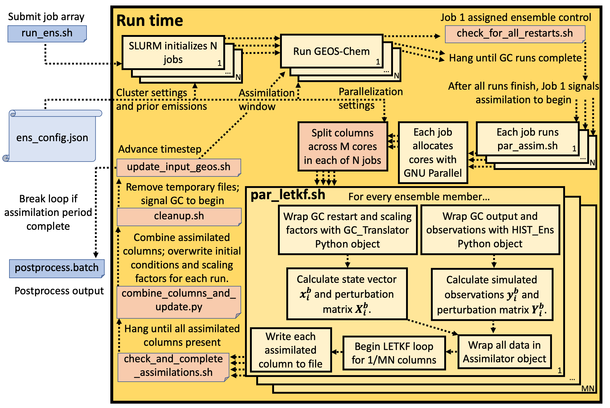

.. _Run the ensemble:

Running the ensemble
==========

In this section, we will discuss in detail the implementation of the CHEEREIO runtime workflow. CHEEREIO is implemented as an array of jobs managed by the SLURM job manager; each job switches between GEOS-Chem and LETKF assimilation mode as coordinated the "job controller" script, as will be explained in detail by this page. See below for a diagram of key scripts and processes that manage this core functionality of CHEEREIO, which we will be referencing throughout this page:

For a given ensemble member, the CHEEREIO runtime process is implemented as a shell loop that repeats until the user-specified period of interest is processed. The details of this shell loop are covered in the :ref:`Run Ensemble Simulations` section farther down on this page. One of the jobs is assigned control of the entire ensemble, analogous to the master process in parallelization. The job controller synchronizes GEOS-Chem runs and LETKF assimilation routines across the ensemble, exploiting the embarrassingly parallel nature of the problem. In the above figure, job controller processes are shown in light red boxes.

After initial job array is submitted, each job calls GEOS-Chem for the current assimilation window. To ensure synchronization, each job hangs after completing GEOS-Chem until the job controller indicates that assimilation can begin. Each computational core within each job is pre-assigned a set of grid cells to assimilate, as the LETKF algorithm is embarrassingly parallel by grid cell. Intra-job parallelization is handled by GNU Parallel. Each core writes assimilated grid cells to a temporary directory. Once all expected grid cells are present, the job controller gathers grid cells and overwrites GEOS-Chem restarts (initial conditions) and scaling factors for each ensemble member. The job controller then cleans up temporary files, advances the time period of interest to the next assimilation window, and signals the job array to begin another GEOS-Chem run. If the entire period of interest is complete, then the job controller ends the job array. The details of the LETKF implementation, in particular the ``GC_Translator`` and other Python objects mentioned in the above figure, are covered on the :ref:`LETKF modules` page. 

CHEEREIO can easily handle scaling factors without GEOS-Chem source code modification because of the HEMCO input module. Scaling factors, initially randomized for each ensemble member in the initialization process, are present in each ensemble member run directory in gridded COARDS-compliant NetCDF form. After each assimilation calculation, the file is updated by CHEEREIO to include the latest scaling factors and corresponding timestamp. HEMCO can read and regrid these latest scaling factors on the fly and feed them directly into GEOS-Chem, enabling seamless interoperability across CHEEREIO runtime processes.

However, before we detail how the ensemble is run for the main assimilation workflow, we first cover the practical details of the ensemble spinup process. All CHEEREIO simulations must undergo ensemble spinup before assimilation can begin (i.e. before the ``run_ens.sh`` script can be submitted in the above diagram).

.. _Run Ensemble Spinup Simulations:

The two ensemble spinup approaches
-------------

As described in the :ref:`Workflow overview` entry, CHEEREIO requires a form of spinup, called "ensemble spinup", which is distinct from the usual form of spinup in chemical transport modeling. The usual spinup (which CHEEREIO also requires) is designed to produce realistic atmospheric conditions that initialize the model. CHEEREIO's ensemble spinup is designed to ensure that each ensemble member has initial atmospheric conditions that are representative of their assigned emissions perturbations. Recall that the LETKF algorithm is an ensemble approach, where each ensemble member is assigned an initially randomized set of emissions scaling factors. These emissions scaling factors are updated throughout assimilation.

The LETKF algorithm requires each ensemble member to have different atmospheric conditions, reflecting the randomized set of emissions scaling factors applied to each ensemble member. This is because the ensemble spread is used to emulate the prior error covariance matrix, a key component of any inversion or data assimilation problem. In practice, this means that before the LETKF process can begin each ensemble member must be run for a period of time with the randomized set of emissions scaling factors applied. This ensemble spinup process creates a diversity of atmospheric concentrations across the ensemble, which leads to a better estimate of the prior error covariance matrix. 

If ensemble spinup is not run, or not run for a sufficient amount of time, then there will not be a sufficient spread in concentrations across the ensemble. This leads to an erroneously small prior error covariance matrix, and in practice will result in CHEEREIO ignoring observation information ("filter divergence"). Again, the spread in concentrations across ensemble members must adequately reflect the spread in emissions perturbations across ensemble members in order for the LETKF to give reliable results. 

There are two ways to do ensemble spinup in CHEEREIO, which we will now discuss.

Method 1: Longer run during the first assimilation period
~~~~~~~~~~~~~

The first and simplest method for ensemble spinup is having GEOS-Chem run for a longer period before the first assimilation period begins. This is implemented via the ``ASSIM_START_DATE`` entry in ``ens_config.json``. The idea is that, during this first GEOS-Chem run, CHEEREIO will run GEOS-Chem from time ``START_DATE`` to time ``ASSIM_START_DATE``. After all ensemble member GEOS-Chem runs reach the ``ASSIM_START_DATE`` time, the LETKF will begin processing an assimilation window beginning at date ``ASSIM_START_DATE`` minus ``ASSIM_TIME`` through ``ASSIM_START_DATE``. 

For example, if ``START_DATE`` is set to January 1, 2019, ``ASSIM_START_DATE`` is set to February 2, 2019, and ``ASSIM_TIME`` is 24 hours, then CHEEREIO will allow every ensemble member to run GEOS-Chem with emissions perturbations applied from January 1, 2019 through February 2, 2019. After all models reach the date February 2, 2019, then CHEEREIO will run LETKF assimilation with assimilation window February 1, 2019 through February 2, 2019. After this point, the model/assimilation loop continues normally with a 24 hour assimilation window. 

Benefits of this approach are its simplicity and lack of additional attention by the user beyond setting an appropriate ``ASSIM_START_DATE``. Note that this option is only recommended for users using GEOS-Chem versions after 13.4. Prior to version 13.4, it is buggy to run GEOS-Chem for a non-standard length of time (e.g. 4 months and a week) which is usually desired for the ensemble spinup. Drawbacks are that GEOS-Chem will save out detailed history data during this run, which can be an inefficient use of memory, and that ensemble spinup simulations must be redone for every additional CHEEREIO simulation using these settings. While for species with short lifetimes (and therefore requiring a short ensemble spinup) these inefficiencies are  insignificant, they can be tedious for longer ensemble spinup simulations.  These inefficiencies can be avoided by using method 2 below.

Method 2: Using a seperate ensemble spinup run
~~~~~~~~~~~~~

The second method for ensemble spinup involves running an entirely separate ensemble spinup ensemble of GEOS-Chem simulations. The ensemble spinup is executed by submitting the ``run_ensspin.sh`` script with the command ``nohup bash run_ensspin.sh &``; after the process completes, then the user can submit the regular ``run_ens.sh`` script as described later on this page. Using a separate job array allows ensemble spinup jobs to have different properties than the regular assimilation process, such as reduced history output frequency. At the end of this array of ensemble spinup jobs, CHEEREIO automatically updates the ensemble to prepare for the regular assimilation process. CHEEREIO also backs up your ensemble automatically in a directory entitled ``RUNNAME_BACKUP``. This enables users to run the ensemble multiple times without repeating the ensemble spinup process. If you would like to use the backup, delete the ensemble directories and copy the backup, renaming the directory appropriately.

Users indicate that they would like to use this ensemble spinup method by setting ``DO_ENS_SPINUP`` to ``true`` within the ``ens_config.json`` file, and also specify the start and end times of ensemble spinup with the ``ENS_SPINUP_START`` and ``ENS_SPINUP_END`` entries. History frequency and duration settings for ensemble spinup are set with the ``SPINUP_HISTORY_freq`` and ``SPINUP_HISTORY_dur`` entries, and in particular can be set to be much more coarse than the regular ensemble, saving disk space. Simulation wall time and memory are set with ``EnsSpinupWallTime`` and ``EnsCtrlSpinupMemory``; because assimilation is turned off for ensemble spinup, users can request much less memory (instead requesting an amount appropriate for a normal GEOS-Chem simulation)

If you are using this approach, set the ``ASSIM_START_DATE`` entry in ``ens_config.json`` to time ``START_DATE`` plus ``ASSIM_TIME``. This is to avoid accidentally combining the two ensemble spinup methods, which would waste computational resources.

.. _Spread amplification:

Amplifying the ensemble spread 
-------------

At the end of the ensemble spinup period, the spread in ensemble members may still not be great enough. If there is insufficient ensemble spread, then the prior error covariance matrix will be underestimated and observation information will be discarded, leading to filter divergence. However, it may not be feasible to run the ensemble spinup simulations for an appropriate amount of time to create a fully appropriate ensemble spread. CHEEREIO includes an option to amplify the standard deviation of the ensemble by a user-specified factor at the end of the ensemble spinup process, improving the specification of the prior error covariance matrix. Think of this as a shortcut users can use for ensemble spinup.

To activate the ensemble spread amplification option, set ``AMPLIFY_ENSEMBLE_SPREAD_FOR_FIRST_ASSIM_PERIOD`` to ``true`` and specify the factor by which the standard deviation will be multiplied with the ``SPREAD_AMPLIFICATION_FACTOR`` within ``ens_config.json``. This spread amplification is done after the first assimilation period, so it will work with either ensemble spinup method, and will also work if users are scaling GEOS-Chem to match observations as described in the next section.

.. _Simple scale:

Scaling GEOS-Chem to match observations 
-------------

Biases between the model and observations (i.e. a systematic model under or overestimate) can lead to suboptimal emissions updates in the LETKF framework. CHEEREIO allows users to handle this problem by scaling the ensemble mean of a given species so that it matches the observational mean, removing overall biases (but not other biases, such as latitudinal issues, which must be handled as appropriate by the user). CHEEREIO implements this scaling by comparing model simulated observation means to observation means within a single assimilation window, and performs this scaling rather than LETKF assimilation for this window. 

There are two assimilation windows currently where CHEEREIO gives users the option to perform this scaling: (1) after ensemble spinup completes, during the first assimilation window of the standard assimilation workflow; and (2) after the burn-in period completes (the burn-in period is described below in :ref:`Burn in period` section). To perform scalings after ensemble spinup completes, set ``SIMPLE_SCALE_FOR_FIRST_ASSIM_PERIOD`` to ``true`` in ``ens_config.json``. To perform scalings after the burn-in period completes, set ``SIMPLE_SCALE_AT_END_OF_BURN_IN_PERIOD`` to ``true`` in ``ens_config.json``. **This procedure is always strongly recommended.**  

.. _Burn in period:

The burn in period
-------------

A burn-in period is a time period where full LETKF assimilation is being applied, but the results will be discarded from final analysis. Burn in periods are somewhat common in Kalman filter applications and are not unique to CHEEREIO. The reason why burn in periods can be necessary is that the data assimilation system has a certain inertia, and takes several assimilation windows to update emissions so that they are more consistent with observations. During the period when emissions rapidly updating from the prior to match observations, it would be incorrect to interpret the results as a timeseries of real changing emissions. Moreover, biases can emerge between modeled concentrations and observations during the burn-in window, as emissions are not yet consistent with observations. 

CHEEREIO allows for a burn-in period, which does two things (1) assimilations that take place during the burn-in period are removed from postprocessing results, and (2) the CHEEREIO ensemble mean is scaled to match the observational mean at the end of the burn-in period, as described in :ref:`:Simple scale`. To enable a burn-in period, set ``SIMPLE_SCALE_AT_END_OF_BURN_IN_PERIOD`` to ``true`` in ``ens_config.json`` and specify the burn-in period end date with the ``BURN_IN_END`` entry. Note that the burn-in period takes place during the normal LETKF run cycle, so the ``BURN_IN_END`` time has to be after ensemble spinup completes and after ``START_TIME``. You also have to specify the postprocessing dates so that they exclude the burn-in period, and can do so with the ``POSTPROCESS_START_DATE`` and ``POSTPROCESS_END_DATE`` entries. 

Starting the run
-------------

Once the ensemble is fully installed, and  ensemble spinup is complete (if using method 2 above), initiating the CHEEREIO run is simple. Navigate to the Ensemble Runs Directory (see the :ref:`Guide to the Ensemble Directory` entry for details on ensemble directory structure). Then, execute the ``run_ens.sh`` script with the command ``nohup bash run_ens.sh &``. That's it!

Monitoring the run progress
-------------

Information about the ensemble state is continuously recorded during run time, and is stored in several locations.

* **Perhaps the most useful way to check on the ensemble is with the ``snapshot.sh`` script in the ``postprocess/`` folder.** The snapshot script (executed with the command ``bash snapshot.sh``) provides (1) a movie of the evolution of scale factors up until the present runtime point, and (2) a timeseries showing the ensemble global mean against the global mean observations. The script takes a few seconds to run and saves the figures into the ensemble postprocess directory.  
* Overall run status for the entire job array (one job per ensemble member) is available from the SLURM scheduler. A good command is ``sacct``, which will display run status (it is especially useful as jobs are pending while resources become available). Each run of GEOS-Chem will be recorded as a separate entry under the ``time`` sub-job label, as each GEOS-Chem run (initialized by the outcome of the previous assimilation step) is submitted with a separate (timed) ``srun`` command. 
* GEOS-Chem run status for individual ensemble members are available in the ``GC.log`` file in each ensemble member run directory.
* Additional log files, including shell-level ``.err`` and ``.out`` files and log files containing data about assimilation, are all available in the ``log`` folder described in :ref:`Ensemble Runs`.
* You can see the start date for the current assimilation window that CHEEREIO is processing by viewing the contents of the ``CURRENT_DATE_TIME`` file within the ``scratch/`` folder. 

.. _Run Ensemble Simulations:

About the Run Ensemble Simulations script
-------------

Although the user will not ever execute the ``run_ensemble_simulations.sh`` script manually, it is very useful in terms of debugging to understand how the script works. We'll walk through it step-by-step.

SBATCH header
~~~~~~~~~~~~~

The first part of the ``run_ensemble_simulations.sh`` script should be familiar to anyone who has worked with the SLURM job scheduler. Entries in curly braces are replaced with user settings from ``ens_config.json`` at Template Run Directory creation time. In short, this part of the script tells the scheduler about the resources required by a single ensemble member, what partition the job should use, and names two files to store shell-level output.  

.. code-block:: bash

	#!/bin/bash

	#SBATCH -J {RunName}
	#SBATCH -c {NumCores}
	#SBATCH -N 1
	#SBATCH -p {Partition}
	#SBATCH --mem {Memory}
	#SBATCH -t {WallTime}
	#SBATCH -o logs/ensemble_slurm_%j.out    # File to which STDOUT will be written, %j inserts jobid       
	#SBATCH -e logs/ensemble_slurm_%j.err    # File to which STDERR will be written, %j inserts jobid

One-time initializations
~~~~~~~~~~~~~

Before GEOS-Chem is run or assimilation can be calculated, a few global settings have to be handled for the ensemble member. First, the software environment must be configured correctly because CHEEREIO requires many modules that can conflict with one another. This is accomplished with the following lines, which (1) purge and load appropriate modules, and (2) configures Anaconda for the subshell that is running the job.

.. code-block:: bash

	#Source clean environment with compatible netcdf and compiler environments and packages like GNU parallel:
	source {ASSIM}/environments/cheereio.env #This is specific to the Harvard cluster; rewrite for yours
	eval "$(conda shell.bash hook)"

Next, a few global variables are set. A few key directories are stored in the variables ``$ENSDIR`` (the Ensemble Runs directory), ``$MY_PATH`` (path to the directory containing all CHEEREIO ensembles), and ``$RUN_NAME`` (the name of this ensemble). The latter two are grabbed from the ``ens_config.json`` file using the ``jq`` command, which allows shell scripts to access data stored in JSON format on the disk. The variable ``$x`` includes the ensemble member ID (ranging from 1 to the total number of ensemble members).  

.. code-block:: bash

	### Run directory
	ENSDIR=$(pwd -P)

	MY_PATH="$(jq -r ".MY_PATH" {ASSIM}/ens_config.json)"
	RUN_NAME="$(jq -r ".RUN_NAME" {ASSIM}/ens_config.json)"

	### Get current task ID
	x=${SLURM_ARRAY_TASK_ID}

	### Add zeros to the current task ID
	if [ $x -lt 10 ]; then
	  xstr="000${x}"
	elif [ $x -lt 100 ]; then
	  xstr="00${x}"
	elif [ $x -lt 1000 ]; then
	  xstr="0${x}"
	else
	  xstr="${x}"
	fi

Next, CHEEREIO initializes a few boolean flags so that it can track whether or not we are in one of two special assimilation windows. If we are in the first assimilation window (``firstrun=true``), as we are at this point in the run script, and the user indicates that we are scaling the ensemble mean to match the observational mean (``scalefirst=true``), then these tags indicate that CHEEREIO should follow the scaling process rather than the LETKF workflow at the appropriate time later in this script. Similarly, if we are in the first assimilation window after burn in completes, the boolean tags will trigger the scaling process. Finally, CHEEREIO also checks if the user indicates that we will amplify the ensemble spread during the first assimilation window.

.. code-block:: bash

	firstrun=true
	scalefirst="$(jq -r ".SIMPLE_SCALE_FOR_FIRST_ASSIM_PERIOD" {ASSIM}/ens_config.json)"
	trigger_burnin_scale=false
	scaleburnin="$(jq -r ".SIMPLE_SCALE_AT_END_OF_BURN_IN_PERIOD" {ASSIM}/ens_config.json)"
	amplifyspread="$(jq -r ".AMPLIFY_ENSEMBLE_SPREAD_FOR_FIRST_ASSIM_PERIOD" {ASSIM}/ens_config.json)"

After all these variables are set, then CHEEREIO navigates to the particular ensemble run directory it has been assigned and exports the proper number of OpenMP threads so that GEOS-Chem can exploit parallelization.

.. code-block:: bash
	
	### Run GEOS-Chem in the directory corresponding to the cluster Id
	cd  {RunName}_${xstr}

	# Set the proper # of threads for OpenMP
	# SLURM_CPUS_PER_TASK ensures this matches the number you set with NumCores in the ens_config file
	export OMP_NUM_THREADS={NumCores}

While loop part 1: Run GEOS-Chem
~~~~~~~~~~~~~

With global settings taken care of, we can now proceed to the while loop that repeatedly runs GEOS-Chem and assimilation routines until the entire ensemble is completed. The whole process starts off with the following while statement:

.. code-block:: bash

	#Run GC; hang until assimilation complete (later also will do assimilation).
	#This will loop until a file appears in scratch signalling assimilation is complete.
	while [ ! -f ${MY_PATH}/${RUN_NAME}/scratch/ENSEMBLE_COMPLETE ]; do

This means that the while loop will continue until a file named ``ENSEMBLE_COMPLETE`` appears in the Scratch folder. The first thing that happens in the while loop is that GEOS-Chem is submitted.

.. code-block:: bash

	# Run GEOS_Chem.  The "time" command will return CPU and wall times.
	# Stdout and stderr will be directed to the "GC.log" log file
	  srun -c $OMP_NUM_THREADS time -p ./gcclassic >> GC.log
	  wait

This runs GEOS-Chem for one assimilation period (often just 24 hours). The ``wait`` command means that the job will hang until the ``srun`` job managing GEOS-Chem is complete. When ``srun`` terminates, CHEEREIO looks at the last line of the ``GC.log`` file and checks if it indicates that GEOS-Chem terminated successfully.

.. code-block:: bash

	  taillog="$(tail -n 1 GC.log)"
	  #Check if GC finished.
	  if [[ "${taillog:0:1}" != "*" ]]; then
	    #This file's presence breaks loop loop
	    printf "GEOS-Chem in ensemble member ${xstr} did not complete successfully\n" > ${MY_PATH}/${RUN_NAME}/scratch/KILL_ENS 
	  fi
	    #If there is a problem, the KILL_ENS file will be produced. Break then
	  if [ -f ${MY_PATH}/${RUN_NAME}/scratch/KILL_ENS ]; then
	    break
	  fi

If GEOS-Chem fails, then the file ``KILL_ENS`` is created and stored in the Scratch directory. Other ensemble members will detect this file and terminate themselves as well, because the ensemble can only continue if all GEOS-Chem runs terminate successfully. However, if everything works, the ensemble member 1 takes on the role as the "job coordinator." This ensemble member checks every second if a restart with the appropriate time stamp is present in each ensemble run directory. If everything is present, then a file labeled ``ALL_RUNS_COMPLETE`` is created and stored in the Scratch directory and we can continue to the assimilation phase (as it breaks the until loop). The rest of the ensemble members just check for the ``KILL_ENS`` file repeatedly and terminate themselves if necessary.

.. code-block:: bash

	    #Ensemble member 1 handles checking. CD to core.
	    if [ $x -eq 1 ]; then
	      cd {ASSIM}/core
	    fi
	    #Hang until ALL_RUNS_COMPLETE found in scratch folder
	    until [ -f ${MY_PATH}/${RUN_NAME}/scratch/ALL_RUNS_COMPLETE ]
	    do
	      #If this is ensemble member 1, look for all restarts and flag if found. Otherwise do nothing.
	      if [ $x -eq 1 ]; then
	        bash check_for_all_restarts.sh #Check if restarts exist; if they do, create ALL_RUNS_COMPLETE.
	      fi
	      #If there is a problem, the KILL_ENS file will be produced. Break then
	      if [ -f ${MY_PATH}/${RUN_NAME}/scratch/KILL_ENS ]; then
	        break 2
	      fi
	      sleep 1
	    done

While loop part 2: Execute parallelized assimilation
~~~~~~~~~~~~~

With all GEOS-Chem runs completed successfully, we can now begin the assimilation process. All ensemble members navigate to the CHEEREIO code directory. Before the LETKF procedure begins, however, we have to see if we are in a special assimilation window which requires a different processing procedure. The ``trigger_burnin_scale`` variable will indicate that we are in the first assimilation window after burn in completes. The ``simplescale`` variable will be set to ``true`` if CHEEREIO is instructed to scale the ensemble mean to match the observational mean, and occurs if we are in either of the two time periods mentioned in the :ref:`Burn in period` entry. The ``doamplification`` variable is set to ``true`` if the user indicates that they would like to amplify ensemble spread after ensemble spinup completes, and we are in the appropriate time period. The ``simplescale`` and ``doamplification`` variables are passed to Python scripts later within this workflow, adjusting the CHEEREIO processes appropriately.  

.. code-block:: bash

	  #CD to core
	  cd {ASSIM}/core
	  #Check if we are in the first assimilation cycle after burn in completes
	  if [ -f ${MY_PATH}/${RUN_NAME}/scratch/BURN_IN_PERIOD_PROCESSED ] && [ ! -f ${MY_PATH}/${RUN_NAME}/scratch/BURN_IN_SCALING_COMPLETE ]; then
	    trigger_burnin_scale=true
	  else
	    trigger_burnin_scale=false
	  fi
	  #Check if we are doing a simple scale or a full assimilation
	  if [[ ("${firstrun}" = "true" && "${scalefirst}" = "true") || ("${trigger_burnin_scale}" = "true" && "${scaleburnin}" = "true") ]]; then
	    simplescale=true
	  else
	    simplescale=false
	  fi
	  #Check if we are amplifying concentration spreads
	  if [[ ("${firstrun}" = "true" && "${amplifyspread}" = "true") ]]; then
	    doamplification=true
	  else
	    doamplification=false
	  fi

Now we submit the ``par_assim.sh`` script via GNU Parallel, triggering the LETKF process.

.. code-block:: bash

	  #Use GNU parallel to submit parallel sruns, except nature
	  if [ $x -ne 0 ]; then
	    if [ {MaxPar} -eq 1 ]; then
	      bash par_assim.sh ${x} 1 ${simplescale} ${doamplification}
	    else
	      parallel -j {MaxPar} "bash par_assim.sh ${x} {1} ${simplescale} ${doamplification}" ::: {1..{MaxPar}}
	    fi 
	  fi

The GNU parallel line works as follows. Up to ``MaxPar`` jobs in a single ensemble member will run the command ``bash par_assim.sh ${x} {1} ${simplescale} ${doamplification}"`` simultaneously. The ``par_assim.sh`` takes four command line inputs: an ensemble ID number; a core ID number; and flags for whether we are doing simple scaling to match observations (rather than LETKF) and whether we will amplify the ensemble spread. The first and last two inputs are supplied by global settings, while the second is supplied by a special GNU Parallel substitution line. Each core will then compute the LETKF data assimilation for each of its assigned columns and save them in ``.npy`` format to the scratch directory. If ``MaxPar`` equals 1 then we can just submit the ``par_assim.sh`` script as a normal bash script.

While loop part 3: Clean-up and ensemble completion 
~~~~~~~~~~~~~

Once this parallelized assimilation is complete, a fair amount of clean up must be done before the entire while loop can repeat. Before CHEEREIO can update the NetCDFs containing restarts and scaling factors in each ensemble member run directory, we have to wait for all columns to be saved to the Scratch directory. The loop thus hangs until a file labeled ``ASSIMILATION_COMPLETE`` appears in the Scratch directory. While we hang, the script ``check_and_complete_assimilation.sh`` is run every second by ensemble member 1. If the number of ``*.npy`` files in scratch matches the expected number of columns, then ensemble member 1 will load all the columns in and update the relevant NetCDFs (and create the ``ASSIMILATION_COMPLETE`` file).

.. code-block:: bash

	  #Hang until assimilation completes or cleanup completes (in case things go too quickly)
	  until [ -f ${MY_PATH}/${RUN_NAME}/scratch/ASSIMILATION_COMPLETE ] || [ ! -f ${MY_PATH}/${RUN_NAME}/scratch/ALL_RUNS_COMPLETE ]; do
	    #If this is ensemble member 1, check if assimilation is complete; if it is, do the final overwrites.
	    if [ $x -eq 1 ]; then
	      bash check_and_complete_assimilation.sh ${simplescale}
	    fi
	    #If there is a problem, the KILL_ENS file will be produced. Break then
	    if [ -f ${MY_PATH}/${RUN_NAME}/scratch/KILL_ENS ]; then
	      break 2
	    fi
	    sleep 1
	  done

Next, we do our usual check for the ``KILL_ENS`` file, which will be generated if any of the CHEEREIO Python scripts fail. If everything works correctly, then ensemble member 1 runs the script ``cleanup.sh``. This clean-up script deletes flag files and column files particular to this assimilation run from the Scratch folder, updates internal state files with the new correct dates, and prepares the ``input.geos`` file in each ensemble member run directory so that we can correctly run GEOS-Chem for the next assimilation period. If this is the first run through the loop, special updates are applied to the HISTORY.rc files to change the frequency of output file creation (i.e. switching from ensemble spinup mode to assimilation mode).

.. code-block:: bash

  #If there is a problem, the KILL_ENS file will be produced. Break then
  if [ -f ${MY_PATH}/${RUN_NAME}/scratch/KILL_ENS ]; then
    break
  fi
  #If this is ensemble member 1, and this is the first run, switch to main assimilation mode with regular intervals.
  if [ $x -eq 1 ] && [ "${firstrun}" = true ]; then
    bash change_histrst_durfreq.sh
  fi
  #For all runs, switch off the first run marker.
  if [ "${firstrun}" = true ]; then
    firstrun=false
  fi
  #If this is ensemble member 1, execute cleanup. This is because we only want it to run once.
  if [ $x -eq 1 ]; then
    bash cleanup.sh #This also will break us out of this loop when assimilation complete.
  fi
  #Hang until cleanup complete, as determined by temp file deletion.
  until [ ! -f ${MY_PATH}/${RUN_NAME}/scratch/ASSIMILATION_COMPLETE ]; do
    #If there is a problem, the KILL_ENS file will be produced. Break then
    if [ -f ${MY_PATH}/${RUN_NAME}/scratch/KILL_ENS ]; then
      break 2
    fi
    sleep 1
  done
	  #CD back to run directory
	  cd ${ENSDIR}/{RunName}_${xstr}

	  #If there is a problem, the KILL_ENS file will be produced. Break then
	  if [ -f ${MY_PATH}/${RUN_NAME}/scratch/KILL_ENS ]; then
	    break
	  fi

	  #Everything cleaned up; we can head back to the beginning.
	done

If, after clean-up completes, our current date now exceeds the ensemble end date stored in the ``ens_config.json`` file, then the file ``ENSEMBLE_COMPLETE`` will appear in the Scratch directory and the while loop will terminate. However, the loop will also terminate if the ``KILL_ENS`` file is created due to a script failure. CHEEREIO picks the exit code for the job accordingly.

.. code-block:: bash

	#If there is a problem, the KILL_ENS file will be produced. Exit with code 1 in that case
	if [ -f ${MY_PATH}/${RUN_NAME}/scratch/KILL_ENS ]; then
	  exit 1
	else
	  exit 0
	fi

